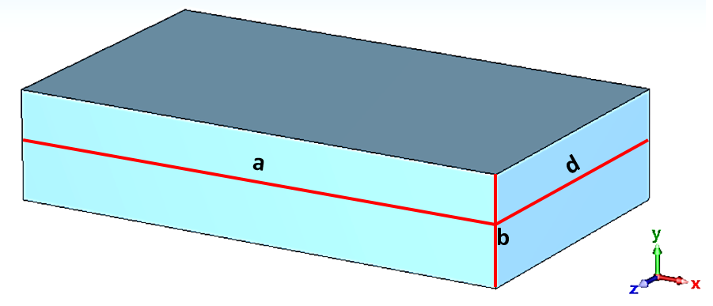
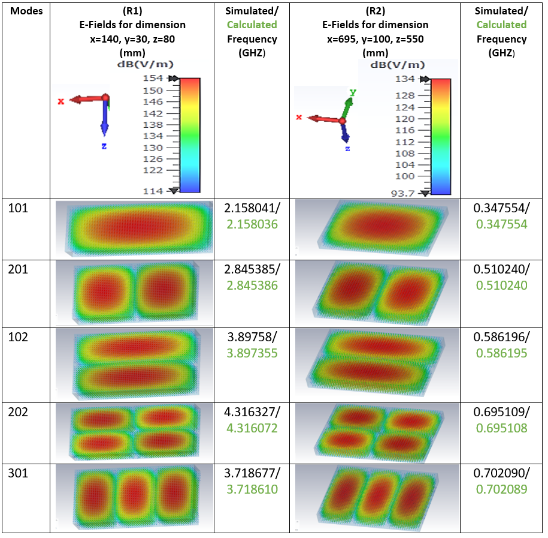
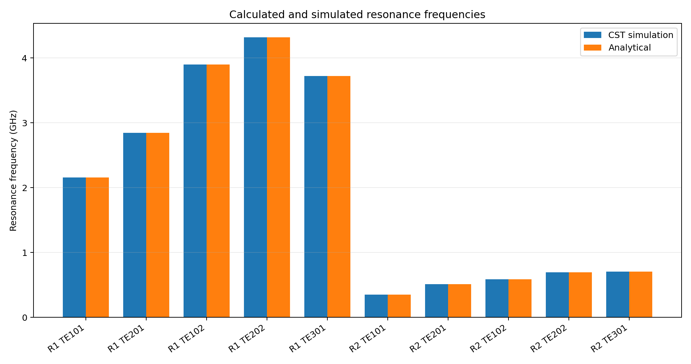
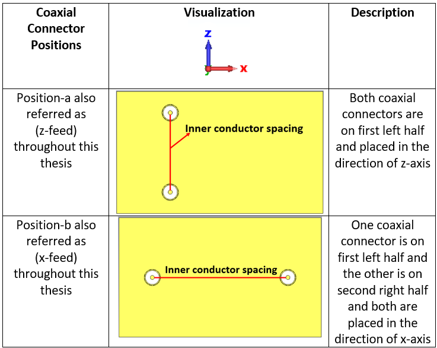
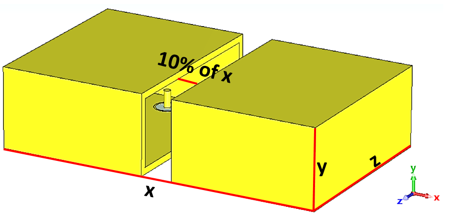
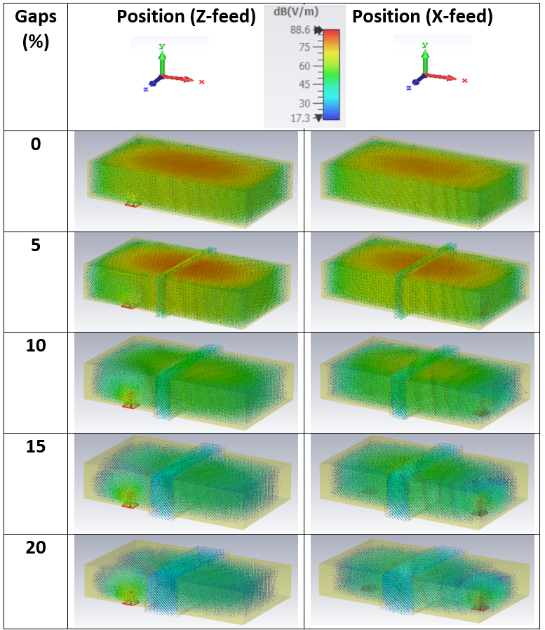
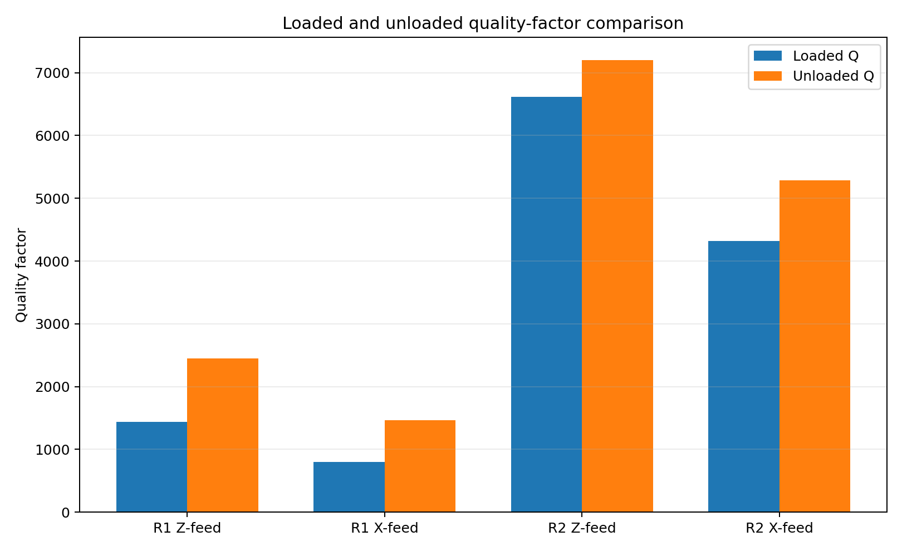
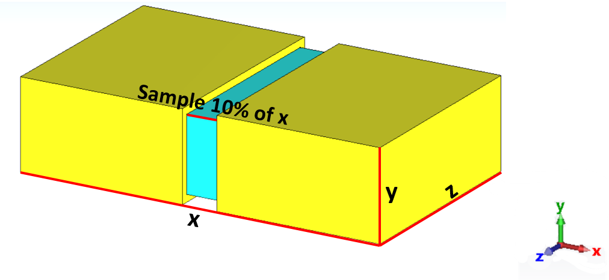

# Microwave Split-Cavity Resonator for Material Characterisation

Master's thesis project completed at Christian-Albrechts-Universitaet zu Kiel in 2025.

The project investigated rectangular split-cavity resonators as microwave sensors for dielectric-material characterisation. CST Studio Suite was used to model electromagnetic fields and S-parameters, while analytical calculations and MATLAB-based post-processing were used to evaluate resonance frequency, -3 dB bandwidth and quality factor.

## Research objective

A dielectric sample perturbs the electromagnetic field stored inside a resonant cavity. The resulting changes in resonance frequency, bandwidth and quality factor can be related to the material's electromagnetic properties.

The project examined how the following parameters influence sensor behaviour:

- Cavity dimensions
- Resonant mode
- Coaxial-probe length and spacing
- X-feed and Z-feed connector positions
- Split-gap size
- Sample thickness
- Relative permittivity
- Loaded and unloaded quality factor

## Resonator designs

| Parameter | Resonator 1 | Resonator 2 |
| --- | ---: | ---: |
| X dimension | 140 mm | 695 mm |
| Y dimension | 30 mm | 100 mm |
| Z dimension | 80 mm | 550 mm |
| Volume | 336,000 mm3 | 38,225,000 mm3 |
| Simulated TE101 frequency | 2.158041 GHz | 0.347554 GHz |



## Analytical validation

For a rectangular cavity filled with vacuum, the resonant frequency is

```text
f_mnl = c/2 * sqrt((m/a)^2 + (n/b)^2 + (l/d)^2)
```

where `a`, `b` and `d` are the cavity dimensions and `m`, `n` and `l` are the mode indices.

For Resonator 1 in TE101 mode:

| Result | Frequency |
| --- | ---: |
| CST simulation | 2.158041 GHz |
| Analytical calculation | 2.158036 GHz |
| Reported deviation | approximately 0.00023% |

For Resonator 2, the simulated and calculated TE101 values were both reported as 0.347554 GHz at the displayed precision.





## Coaxial-probe investigation

Two feed orientations were investigated:

- **Z-feed:** the coaxial connectors were separated along the Z axis.
- **X-feed:** the coaxial connectors were separated along the X axis.



For Resonator 1, pin lengths from 5 mm to 9 mm were studied. For Resonator 2, pin lengths from 20 mm to 40 mm were studied. Connector spacing ranged from 30% to 80% of the applicable cavity dimension.

A spacing of 70% was selected as a stable configuration. At this spacing, the reported difference from the eigenmode frequency was:

| Configuration | Frequency difference |
| --- | ---: |
| R1 Z-feed | 0.30% |
| R1 X-feed | 0.60% |
| R2 Z-feed | 0.02% |
| R2 X-feed | 0.04% |

## Split-cavity behaviour

Gap sizes of 0%, 5%, 10%, 15% and 20% of the cavity X dimension were evaluated.



Increasing the gap allowed the electric field to extend into the split region. Larger gaps reduced field confinement, lowered the resonance frequency, increased bandwidth and reduced the loaded quality factor. The 20% configuration no longer showed useful resonant behaviour in the investigated range.



## Quality-factor comparison

The loaded quality factor was calculated from resonance frequency and -3 dB bandwidth:

```text
Q_L = resonance_frequency / bandwidth
```

| Configuration | Loaded Q | Unloaded Q | Reduction after loading |
| --- | ---: | ---: | ---: |
| R1 Z-feed | 1,435.16 | 2,453.23 | 41.50% |
| R1 X-feed | 798.09 | 1,469.27 | 45.68% |
| R2 Z-feed | 6,615.24 | 7,201.32 | 8.14% |
| R2 X-feed | 4,322.54 | 5,282.63 | 18.17% |



The larger resonator retained a substantially higher loaded Q, while the smaller resonator was more sensitive to loading from the external coupling structure.

## Dielectric-material perturbation

A dielectric sample was inserted into the split region.



The sample-thickness condition investigated in the thesis was:

```text
(2*pi/lambda) * t_x * sqrt(epsilon_r) << 1
```

At 10% sample thickness, the estimated upper relative-permittivity ranges were approximately 2.45 for Resonator 1 and 3.85 for Resonator 2. Increasing relative permittivity reduced resonance frequency. Excessive sample thickness or permittivity increased the risk of mode overlap and difficult mode identification.

## Reproducible analysis

The repository includes a Python script that:

- Calculates analytical resonant frequencies from cavity dimensions and mode indices
- Compares analytical values with the CST results reported in the thesis
- Calculates percentage deviations
- Verifies the loaded/unloaded Q-factor reductions
- Generates comparison charts

Run it with:

```bash
python -m pip install -r requirements.txt
python analysis/resonator_analysis.py
```

Generated tables and figures are written to `outputs/`.

## Repository structure

```text
microwave-split-cavity-resonator/
├── README.md
├── PROFILE_ENTRY.md
├── NOTICE.md
├── requirements.txt
├── analysis/
│   └── resonator_analysis.py
├── data/
│   ├── cavity_designs.csv
│   ├── q_factors.csv
│   └── resonance_modes.csv
├── assets/
│   ├── analysis/
│   └── cst/
└── docs/
    ├── methodology.md
    ├── results-and-limitations.md
    └── thesis-data-summary.md
```

## Skills demonstrated

`CST Studio Suite` `Microwave resonators` `Electromagnetic simulation` `S-parameters` `Resonance analysis` `Quality factor` `MATLAB` `Python` `Parameter studies` `Dielectric sensing` `Technical documentation`

## Author

**Muhammad Kazim**  
M.Sc. Electrical and Information Engineering  
[LinkedIn](https://www.linkedin.com/in/muhammad-kazim786/) | [GitHub](https://github.com/muhammadkazim763-hub)
